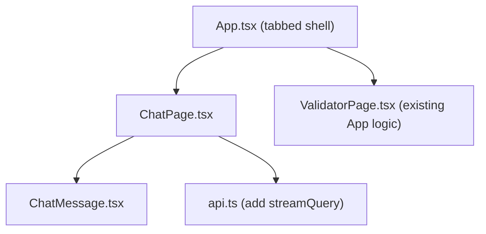

# Chat Frontend Tab

## Architecture

## What changes

- **`src/App.tsx`** — Becomes a tab shell with two tabs: `chat` (default) and `validator`. Renders `<ChatPage>` or `<ValidatorPage>` based on active tab.
- **`src/pages/ValidatorPage.tsx`** (new) — The current `App` component body (form + panels) extracted verbatim into its own component.
- **`src/pages/ChatPage.tsx`** (new) — Chat UI with message list, user input, and streaming response handling.
- **`src/components/ChatMessage.tsx`** (new) — Renders a single message bubble (user or assistant role).
- **`src/api.ts`** — Add `streamQuery(query, onChunk, onDone, onError): AbortController` using `fetch` + `ReadableStream` to consume the SSE `data: …\n\n` / `data: [DONE]\n\n` / `data: [ERROR] …\n\n` protocol.
- **`vite.config.ts`** — Add `/query` proxy entry alongside `/parse`, `/validate`, `/health`.

## SSE protocol (existing backend)

- Each chunk: `data: <text>\n\n`
- Error: `data: [ERROR] <message>\n\n`
- End: `data: [DONE]\n\n`

## Chat UI design

Consistent with existing dark design system — same CSS variables, fonts, panel/border radius conventions:

- **Tab bar** — JetBrains Mono uppercase labels with `var(--accent)` active underline, sits below the header.
- **Message list** — scrollable area; user messages right-aligned with `var(--accent)` background tint; assistant messages left-aligned on `var(--surface)` with `var(--border)`.
- **Input row** — full-width textarea (auto-resize, Enter submits, Shift+Enter newline) + "Send" button styled like the existing "Run" button.
- **Streaming** — assistant bubble appears immediately with a blinking cursor; text appends token-by-token; cursor disappears on `[DONE]`.
- **Loading state** — send button shows spinner + "Sending…" label (reuse spin keyframe already in index.css).
- **Error state** — inline error bubble below the assistant message, styled with `var(--err)`.

## File summary

| File | Action |
|------|--------|
| `src/App.tsx` | Replace with tabbed shell (~60 lines) |
| `src/pages/ValidatorPage.tsx` | New — paste existing App body |
| `src/pages/ChatPage.tsx` | New — chat UI (~200 lines) |
| `src/components/ChatMessage.tsx` | New — message bubble |
| `src/api.ts` | Add `streamQuery` function |
| `vite.config.ts` | Add `/query` proxy |
