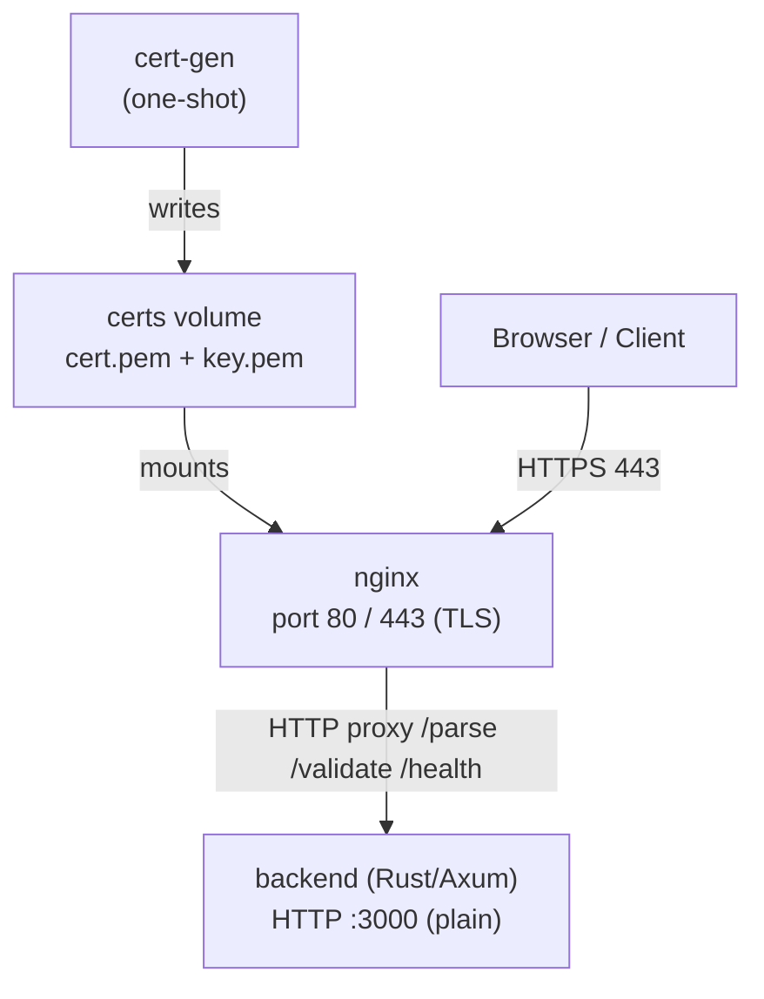

# Docker Compose Production Setup

## Architecture

TLS terminates at nginx. The backend speaks plain HTTP on the private `app-net` bridge — no certs needed inside the container.



## Files to Create

### SSL Certificate Generation

- `docker/generate_certs.sh` — shell script that uses `openssl` to generate a self-signed cert+key into a shared Docker volume (`/certs`). SANs cover `localhost` and the `frontend` service name. Only nginx mounts this volume.

### Backend Multi-Stage Dockerfile

- `docker/backend/Dockerfile` — two stages:
  - **`builder`** — `rust:1.87-slim-bookworm`; installs `libxml2-dev pkg-config`, copies source, runs `cargo build --release`
  - **`runtime`** — `debian:bookworm-slim`; installs only `libxml2` (runtime dep), copies binary + `schemas/`; runs as non-root user `appuser`; **no certs needed**

### Frontend Multi-Stage Dockerfile

- `docker/frontend/Dockerfile` — two stages:
  - **`builder`** — `node:22-alpine`; `npm ci`, `npm run build` (produces `dist/`)
  - **`runtime`** — `nginx:1.27-alpine`; copies `dist/` and an nginx config; non-root execution via `nginx -g 'daemon off;'`

### Nginx Configuration (Production)

- `docker/frontend/nginx.conf` — serves static files from `dist/`, proxies `/parse`, `/validate`, `/health` to `http://backend:3000` (plain HTTP on internal network), uses cert volume for HTTPS on port 443, redirects HTTP→HTTPS on port 80.

### Docker Compose Files

**`docker-compose.yml`** (base/shared):
- Services: `cert-gen`, `backend`, `frontend`
- Named volume `certs` — mounted **only by `cert-gen` and `frontend`** (nginx); backend has no cert dependency
- Bridge network `app-net`

**`docker-compose.override.yml`** (development — auto-loaded by `docker compose up`):
- `backend`: bind-mount source, `LOG_LEVEL=debug`, port `3000:3000` exposed directly
- `frontend`: runs Vite dev server (`npm run dev`), port `5173:5173`
- `cert-gen`: always re-runs

**`docker-compose.prod.yml`** (production — explicit with `-f`):
- `backend`: `restart: unless-stopped`, no source bind-mounts, resource limits
- `frontend`: nginx runtime image, port `443:443` + `80:80`, `restart: unless-stopped`
- `cert-gen`: `restart: no`, runs once

### Environment Files

- `.env.example` — documents all vars (`HOST`, `PORT`, `LOG_LEVEL`) with safe defaults; `TLS_CERT`/`TLS_KEY` are **not needed** for the containerised backend; committed to git
- `.env` — actual values; added to `.gitignore`

## Key Implementation Details

### cert-gen service

Uses `alpine/openssl` image running `docker/generate_certs.sh`:
```
openssl req -x509 -newkey rsa:4096 -keyout /certs/key.pem -out /certs/cert.pem \
  -days 365 -nodes -subj "/CN=localhost" \
  -addext "subjectAltName=DNS:localhost,DNS:frontend,IP:127.0.0.1"
```
- Only `frontend` (nginx) depends on cert-gen via `condition: service_completed_successfully`.
- Backend has **no dependency** on cert-gen.

### Backend Dockerfile highlights

- `cargo build --release` in builder
- Copies only the binary + `schemas/` into `debian:bookworm-slim`
- **Requires a small `src/main.rs` change**: add an optional plain-HTTP mode (e.g. `USE_TLS=false` env var). When `USE_TLS=false`, fall back to `axum::serve` over a plain `TcpListener` instead of `axum_server::bind_rustls`. The default remains TLS-on so local dev (`cargo run`) still works unchanged.
- `HOST=0.0.0.0`, `PORT=3000`, `USE_TLS=false` set in Docker env
- Health check: `curl -f http://localhost:3000/health` (plain HTTP)
- Non-root user created with `useradd -r appuser`

### Frontend nginx.conf (production)

- Port 80 → 301 redirect to 443
- Port 443 with TLS (certs from shared `certs` volume at `/etc/nginx/certs/`)
- `proxy_pass http://backend:3000` for `/parse`, `/validate`, `/health` — plain HTTP on the internal network, no `proxy_ssl_verify` needed
- Static files from `/usr/share/nginx/html` with `try_files`

### Health checks

- `backend`: `curl -f http://localhost:3000/health` every 30s (plain HTTP)
- `frontend`: `wget -q --spider https://localhost/health` (via nginx, HTTPS) every 30s
- `cert-gen`: none needed (one-shot)

### Restart policies

- `backend`: `unless-stopped`
- `frontend`: `unless-stopped`
- `cert-gen`: `no`

## File Tree to Be Created

```
docker/
├── backend/
│   └── Dockerfile
├── frontend/
│   ├── Dockerfile
│   └── nginx.conf
└── generate_certs.sh
docker-compose.yml
docker-compose.override.yml
docker-compose.prod.yml
.env.example
```

## Usage

```bash
# Development
docker compose up --build

# Production
docker compose -f docker-compose.yml -f docker-compose.prod.yml up --build -d
```
