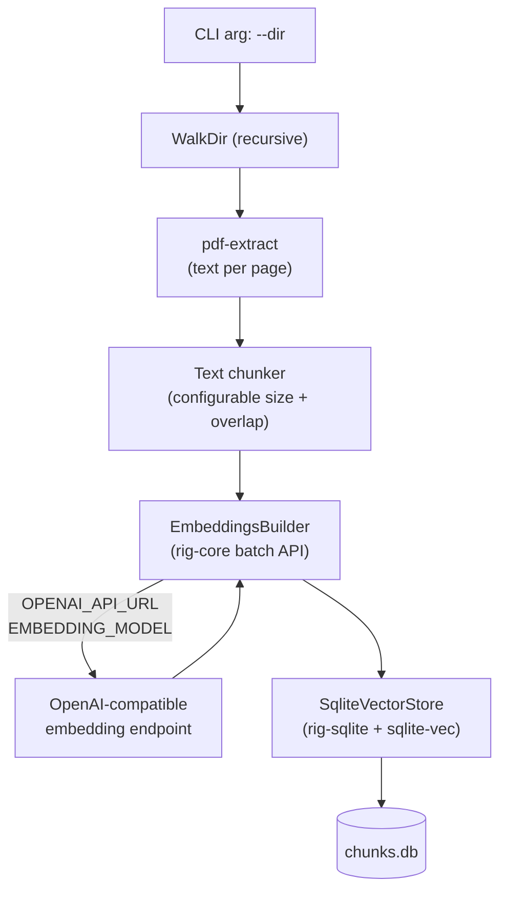

# PDF Embedding Indexer

Add `src/bin/index_pdfs.rs` — a standalone Tokio binary that accepts a PDF directory, produces embeddings, and persists them to SQLite using `rig-sqlite`.

## Architecture



## New dependencies (Cargo.toml)

- `rig-core = "0.7"` — `EmbeddingsBuilder`, `Embed` derive macro, OpenAI provider
- `rig-sqlite = "0.1"` — `SqliteVectorStore` backed by `sqlite-vec`
- `pdf-extract = "0.7"` — pure-Rust PDF text extraction
- `walkdir = "2"` — recursive directory traversal
- `rusqlite = { version = "0.31", features = ["bundled"] }` — SQLite connection
- `sqlite-vec = "0.1"` — vector extension for SQLite
- `anyhow = "1"` — error handling in the binary
- `clap = { version = "4", features = ["derive"] }` — CLI argument parsing
- `tokio = "1"` (already present)

## Environment variables

| Var | Default | Purpose |
|-----|---------|---------|
| `OPENAI_API_URL` | `https://api.openai.com/v1` | Base URL for embedding calls (supports any compatible endpoint) |
| `OPENAI_API_KEY` | *(required)* | Auth token |
| `EMBEDDING_MODEL` | `text-embedding-3-small` | Model name |
| `CHUNK_SIZE` | `512` | Target chunk size in characters |
| `CHUNK_OVERLAP` | `64` | Overlap between consecutive chunks |
| `DB_PATH` | `chunks.db` | Output SQLite file path |

## Chunk document struct

```rust
#[derive(Embed, Serialize, Deserialize, Clone, Debug)]
struct PdfChunk {
    id: String,          // "{filename}::p{page}::c{chunk_idx}"
    file_name: String,
    page: usize,
    chunk_index: usize,
    #[embed]
    content: String,     // the text that gets embedded
}
```

## Key implementation points

- `[[bin]]` entry in `Cargo.toml` pointing to `src/bin/index_pdfs.rs` (Rust convention; `src/bin/` is automatically detected).
- PDF extraction uses `pdf_extract::extract_text_from_mem`, tolerating per-file errors with a logged warning.
- Chunking: slide a character window of `CHUNK_SIZE` with `CHUNK_OVERLAP` steps, trim whitespace, skip empty chunks.
- Call `EmbeddingsBuilder::new(model).documents(batch)?..build().await?` in batches of ≤ 100 chunks (OpenAI API limit).
- Initialize `sqlite-vec` extension before opening DB (`unsafe { sqlite3_auto_extension(...) }`).
- Create `SqliteVectorStore` from an open `rusqlite::Connection` and call `insert_documents`.
- Log progress per file with `tracing`; print final summary to stdout.
- Binary exits with code 1 on unrecoverable errors.

## Files changed

- [`Cargo.toml`](Cargo.toml) — add new `[dependencies]` and `[[bin]]` section
- [`src/bin/index_pdfs.rs`](src/bin/index_pdfs.rs) — new file (the binary)
