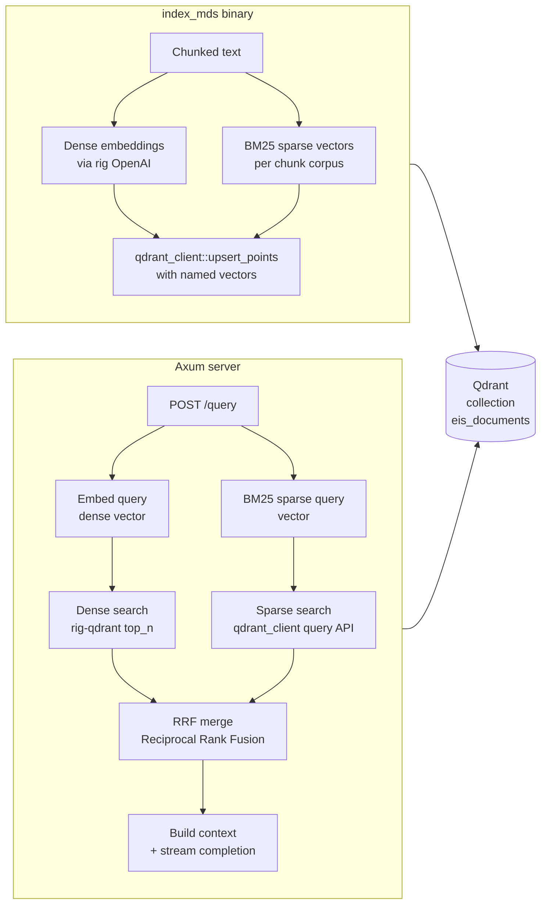

# Qdrant RAG Migration

## New dependencies (`Cargo.toml`)

Remove: `rig-sqlite`, `rusqlite`, `tokio-rusqlite`, `sqlite-vec`

Add:
- `rig-qdrant = "0.2.4"` — rig `VectorStoreIndex` + `InsertDocuments` impl over Qdrant
- `qdrant-client = "1.17.0"` — direct client for collection management and sparse upserts
- `bm25 = "2.3.2"` — BM25 corpus statistics → sparse term-weight vectors

Keep all other deps unchanged.

---

## Architecture overview



---

## Collection schema

One Qdrant collection `eis_documents` with:
- **dense vector** `"dense"` — cosine, `EMBEDDING_NDIMS` dims (default 1536)
- **sparse vector** `"sparse"` — `SparseVectorParams` with `Modifier::Idf` (native BM25-style scoring)
- **payload** — `file_name` (string), `page` (string), `chunk_index` (string), `content` (string), `id` (string)

---

## Files changed / added

### `Cargo.toml`
Swap SQLite deps for `rig-qdrant`, `qdrant-client`, `bm25`.

### `src/config.rs`
Add three new fields (read from env, no defaults that break existing non-Qdrant configs):
- `qdrant_url: String` — default `"http://localhost:6334"`
- `qdrant_api_key: Option<String>` — from `QDRANT_API_KEY`
- `qdrant_collection: String` — default `"eis_documents"` (replaces `db_path`)

Keep `db_path` field as `#[allow(dead_code)]` (or remove) and document the migration.

### `src/repository/eis_documents.rs`
- Keep `EisDocuments` struct and `#[derive(Embed, Serialize, Deserialize)]` unchanged.
- **Remove** `SqliteVectorStoreTable` impl (no longer needed).
- Add a `bm25_sparse(content: &str, vocab: &Bm25Vocab) -> SparseVector` helper used during indexing.

### `src/repository/mod.rs`
Replace `SqliteVectorIndex` / `VectorIndex` type alias with `QdrantVectorStore`:

```rust
pub type VectorIndex = QdrantVectorStore<EmbedModel>;

pub struct EisRepository {
    pub vector_index: VectorIndex,       // dense search via rig-qdrant
    pub qdrant_client: Arc<Qdrant>,      // sparse + hybrid search
    pub collection: String,
    pub embed_model: EmbedModel,
}
```

Rewrite `search` to:
1. Embed query → dense vector
2. Build BM25 sparse query vector from query tokens
3. Issue both searches via `qdrant_client.query(…)` with named vector
4. Merge results with Reciprocal Rank Fusion (RRF, k=60)
5. Return `Vec<(f64, EisDocuments)>` (same signature — no changes needed in `query.rs`)

### `src/state.rs`
- Remove all SQLite/`rusqlite`/`sqlite-vec` code and `unsafe` block.
- Build `Qdrant` client from `config.qdrant_url` + `config.qdrant_api_key`.
- Construct `QdrantVectorStore` using `rig-qdrant`'s `QdrantVectorStore::new(client, model, query_params)`.
- Build `EisRepository { vector_index, qdrant_client, collection, embed_model }`.

### `src/bin/index_mds.rs`
- Remove all SQLite/`rusqlite`/`sqlite-vec` imports and setup.
- Add `QDRANT_URL`, `QDRANT_API_KEY`, `QDRANT_COLLECTION` env vars (with same defaults as config).
- On startup, create or recreate the Qdrant collection with both named vectors (idempotent `create_collection`; skip if `--append`).
- Build a corpus-level `bm25::Bm25` model over all chunk texts **before** inserting (two-pass: collect all text, fit BM25, then embed+upsert).
- For each batch, call `qdrant_client.upsert_points` with `NamedVectors` containing `"dense"` and `"sparse"` entries.
- Remove `DB_PATH` env; add `QDRANT_URL` / `QDRANT_API_KEY` / `QDRANT_COLLECTION`.

### `.env.example`
Replace `DB_PATH` section with:
```
QDRANT_URL=http://localhost:6334
# QDRANT_API_KEY=<your-key>
QDRANT_COLLECTION=eis_documents
```

### `AGENTS.md`
Update layout, env vars table, and prerequisites (Qdrant server required instead of SQLite file).

---

## Key implementation notes

- **`rig-qdrant` insert path**: `QdrantVectorStore::insert_documents(embeddings)` stores only the `"dense"` vector and payload. Sparse vectors require a second `qdrant_client.upsert_points` call (or a custom points builder) in the same batch, updating the same point IDs with a `NamedVectors` patch.
- **BM25 sparse vectors** are computed using the `bm25` crate: fit a `Bm25` instance on all chunk texts, then call `bm25.embed(text)` → sparse `(indices: Vec<u32>, values: Vec<f32>)`.
- **Hybrid query**: Issue two `QueryPointsBuilder` requests in parallel (`tokio::join!`) — one with `query(dense_vec)` on `"dense"` vector, one with `query(sparse_vec)` on `"sparse"` vector — then merge via RRF.
- **No changes to `query_handler`** in `src/handlers/query.rs` — the `repository.search` signature stays `async fn search(&self, query: &str, top_k: u64) -> anyhow::Result<Vec<(f64, EisDocuments)>>`.
- **Stale tests in `query.rs`**: The tests asserting English strings (`"Retrieved context"`, `"No relevant documents"`, `"Cite source files"`) are already broken against the Russian prompt — fix them as part of this PR.
