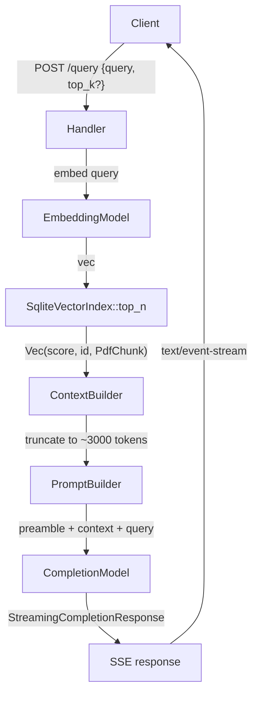

# RAG Query Streaming Handler

## Architecture



## Changes Required

### 1. `src/config.rs` - Add RAG-related config fields

Extend `AppConfig` with:
- `openai_api_key: Option<String>` (from `OPENAI_API_KEY`)
- `openai_base_url: Option<String>` (from `OPENAI_BASE_URL`)
- `embedding_model: String` (from `EMBEDDING_MODEL`, default `text-embedding-3-small`)
- `embedding_ndims: usize` (from `EMBEDDING_NDIMS`, default 1536)
- `completion_model: String` (from `COMPLETION_MODEL`, default `gpt-4o-mini`)
- `db_path: String` (from `DB_PATH`, default `chunks.db`)

### 2. `src/main.rs` - Initialize shared RAG state

Load `.env` via `dotenvy`, build the `AppState` (holding the `SqliteVectorIndex` and `openai::Client`), and pass it to `app_routes()`.

Initialize the `sqlite-vec` extension via `sqlite3_auto_extension` before opening the connection (same pattern as `index_pdfs.rs`).

### 3. `src/handlers/query.rs` - New handler (the core work)

**Request:** `Json<QueryRequest>` with `{ query: String, top_k: Option<usize> }` (default `top_k = 5`)

**SSE response:** `text/event-stream`, each chunk is `data: <token>\n\n`, final chunk is `data: [DONE]\n\n`.

**Logic:**
1. Run `index.top_n::<PdfChunk>(VectorSearchRequest::builder().query(&query).samples(top_k).build()?)` 
2. If no results → stream a single "No relevant context found" message
3. Accumulate `content` fields, budget tokens as `chars / 4` (rough approximation), truncate chunks until total ≤ `MAX_CONTEXT_CHARS` (configurable constant, e.g. 12000 chars ≈ 3000 tokens)
4. Build prompt: system preamble + context block + user query
5. Call `completion_model.completion_request(&query).preamble(system_prompt).stream().await`
6. Drive the `StreamingCompletionResponse` stream; for each `StreamedAssistantContent::Text(t)` yield `data: {text}\n\n`
7. On stream end, send `data: [DONE]\n\n`

**Error handling:** 400 if query is blank, 503 if OpenAI key missing, 500 on store/model errors; errors mid-stream are sent as `data: [ERROR] <msg>\n\n` before closing.

**Token limit guard:** `MAX_CONTEXT_CHARS = 12_000` constant (≈3k tokens). Chunks are already scored by cosine similarity; take the top ones that fit, discarding lower-ranked ones.

### 4. `src/handlers/mod.rs` - Re-export `query_handler`

Add `pub mod query;` and `pub use query::query_handler;`.

### 5. `src/routes/mod.rs` - Register route and accept `AppState`

```rust
pub fn app_routes(state: AppState) -> Router {
    Router::new()
        .route("/health", get(handlers::health))
        .route("/validate", post(handlers::validate_handler))
        .route("/parse", post(handlers::parse_handler))
        .route("/query", post(handlers::query_handler))
        .with_state(state)
}
```

### 6. `Cargo.toml` - Add `futures` dependency

The `futures` crate (for `StreamExt`) is a transitive dep of `rig-core` but not listed directly. Add `futures = "0.3"` to `[dependencies]`. Also add `axum = { features = ["multipart"] }` already present — no change needed there.

### 7. `.env.example` - Document new env vars

Add `COMPLETION_MODEL=gpt-4o-mini` and note about `DB_PATH` being shared with `index_pdfs`.

## Key Implementation Details

- **`AppState`** is an `Arc`-wrapped struct containing the typed `SqliteVectorIndex<EmbeddingModel, PdfChunk>` and the `openai::CompletionModel`. Because `SqliteVectorIndex` is generic over the concrete model types from rig, the state will need to use concrete types (not trait objects) or store the index as `Arc<dyn VectorStoreIndex>`. Given the complexity of the trait bounds, the simpler path is to use concrete types and store them in a struct with `#[derive(Clone)]`.
- **SSE via Axum:** Return `axum::response::Response` with `Content-Type: text/event-stream` and `Cache-Control: no-cache`. Body is a `Body::from_stream(...)` wrapping a `tokio_stream::StreamExt` that maps chunks to `Ok::<_, Infallible>(Bytes::from(...))`.
- **`futures` / `StreamExt`:** Already available as a rig-core transitive dep; add explicitly to avoid breakage if rig version changes.
