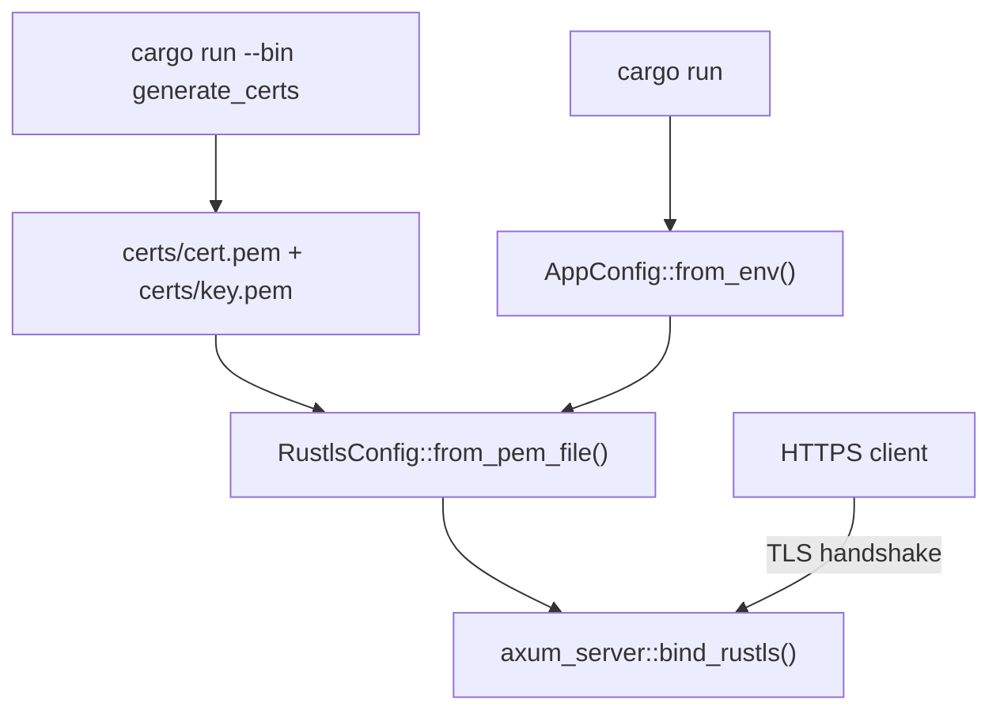

# SSL Support & Self-Signed Certs

## Approach

- Add `axum-server` (with `tls-rustls` feature) to replace the raw `tokio::net::TcpListener` + `axum::serve` combo.
- Add `rcgen` to generate a self-signed certificate (PEM format) during a one-time `generate-certs` binary/script.
- Certs are written to `certs/cert.pem` and `certs/key.pem`.
- Server loads them at startup; if the files are missing, it panics with a clear message.

## Dependencies to add ([`Cargo.toml`](Cargo.toml))

```toml
axum-server = { version = "0.7", features = ["tls-rustls"] }
rcgen       = "0.13"
```

## New binary: `src/bin/generate_certs.rs`

Uses `rcgen::generate_simple_self_signed` to produce `certs/cert.pem` and `certs/key.pem`. Accepts a list of SANs (defaults to `["localhost"]`).

```rust
// usage: cargo run --bin generate_certs
// or:    cargo run --bin generate_certs -- localhost 127.0.0.1
```

## Config changes ([`src/config.rs`](src/config.rs))

Add two new fields:

- `tls_cert_path: String` — env `TLS_CERT` (default: `certs/cert.pem`)
- `tls_key_path: String`  — env `TLS_KEY`  (default: `certs/key.pem`)

## Server changes ([`src/main.rs`](src/main.rs))

Replace:

```rust
let listener = tokio::net::TcpListener::bind(addr).await?;
axum::serve(listener, app).with_graceful_shutdown(...).await?;
```

With:

```rust
let tls_config = RustlsConfig::from_pem_file(&config.tls_cert_path, &config.tls_key_path)
    .await
    .expect("failed to load TLS certs — run `cargo run --bin generate_certs` first");

axum_server::bind_rustls(addr, tls_config)
    .handle(handle)
    .serve(app.into_make_service())
    .await?;
```

Graceful shutdown is wired through `axum_server::Handle`.

## AGENTS.md updates

- Document new env vars (`TLS_CERT`, `TLS_KEY`).
- Add cert generation step to Setup Instructions.
- Update curl examples to use `https://` (with `-k` for self-signed).

## Data flow after change


