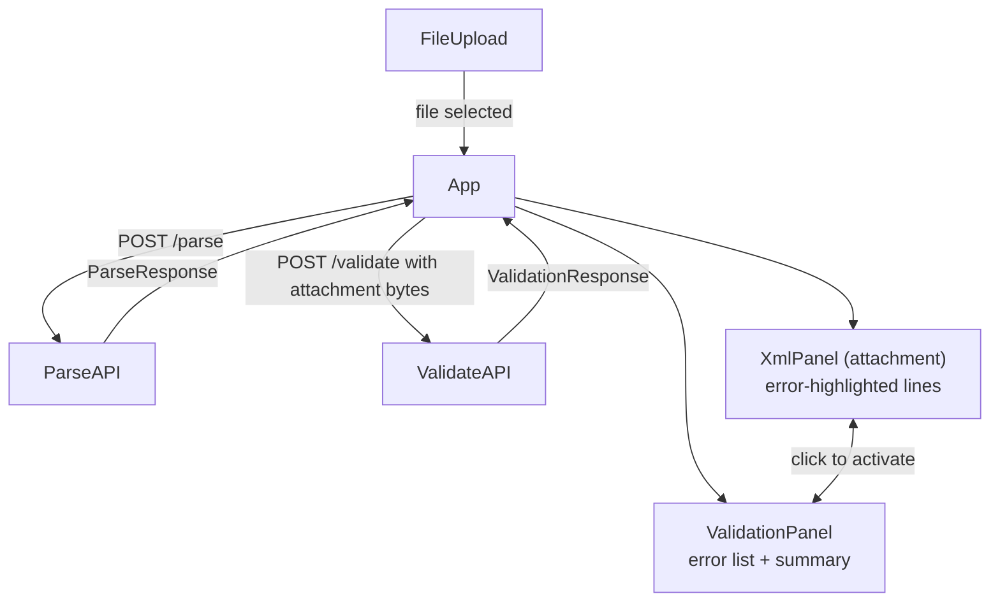

# Validate Integration Frontend

## Architecture



## Files to change

### 1. [`frontend/vite.config.ts`](frontend/vite.config.ts)
Add `/validate` to the proxy table alongside `/parse`:
```typescript
proxy: {
  "/parse":    "http://localhost:3000",
  "/validate": "http://localhost:3000",
}
```

### 2. [`frontend/src/api.ts`](frontend/src/api.ts)
Add TypeScript types mirroring the Rust structs and a `validateAttachment` function:
```typescript
export interface ValidationError {
  message: string | null;
  level: string;       // "Error" | "Warning"
  line: number | null;
  column: number | null;
  filename: string | null;
}
export interface ValidationResponse {
  valid: boolean;
  errors: ValidationError[];
}
export async function validateAttachment(xmlText: string): Promise<ValidationResponse>
```
The function creates a `Blob` from the string, wraps it in `FormData` with a `file` field, then `POST`s to `/validate`.

### 3. [`frontend/src/App.tsx`](frontend/src/App.tsx)
- Extend `AppState` to hold `validation?: ValidationResponse` alongside `result`.
- After `parseEisPackage` resolves, immediately call `validateAttachment(result.attachment)` (fire-and-forget into state, so the parse result shows instantly while validation is in-flight).
- Track a separate `validating: boolean` flag so the attachment panel can show a validation-in-progress indicator.
- Change the layout from a single column to a two-column grid when results are present:
  - Left column: `XmlPanel` for `attachment`, with `errorLines` prop (set of line numbers with errors).
  - Right column: new `ValidationPanel` receiving `response`, `activeIdx`, and `onActivate` callback.
  - Keep the existing `document` `XmlPanel` above the two-column section (full-width, unchanged).
- Wire up `activeIdx` state so clicking an error in `ValidationPanel` highlights the corresponding line in the attachment `XmlPanel`, and vice versa.

### 4. [`frontend/src/components/XmlPanel.tsx`](frontend/src/components/XmlPanel.tsx)
Add optional props:
```typescript
interface XmlPanelProps {
  label: string;
  content: string;
  errorLines?: Map<number, ValidationError>;  // 1-based line → error
  activeErrorLine?: number | null;
  onLineClick?: (line: number) => void;
}
```
When `errorLines` is provided:
- Line number gutter: color error lines `var(--err)` / warning lines `var(--warn)` (`.has-error` / `.has-warning` from the reference).
- Code line row: add left red border + red-tinted background for error lines (`error-line` style from reference).
- Active line: accent yellow highlight (`active` style from reference).
- Inline error icon: small `ⓘ` SVG circle with a hover tooltip showing the truncated message (from reference `.err-icon` / `.err-tooltip`).
- Add a status bar below the code area (e.g. "validation failed · N errors") only when `errorLines` is passed — matching the `.status-bar` from the reference.

### 5. New [`frontend/src/components/ValidationPanel.tsx`](frontend/src/components/ValidationPanel.tsx)
New component (right column). Props:
```typescript
interface ValidationPanelProps {
  response: ValidationResponse;
  validating?: boolean;
  activeIdx: number | null;
  onActivate: (idx: number) => void;
}
```
Renders:
- **Panel title bar** in the existing `panel-title` style (`• errors`).
- **Scrollable error list**: each item is an `error-item` div with:
  - Level dot (red or amber glow).
  - Location: `line N · col M` (from reference `.err-location`).
  - Message text (from reference `.err-message`).
  - Level tag badge (`Error` / `Warning`, from reference `.err-tag`).
  - `active` class when `idx === activeIdx`; clicking calls `onActivate(idx)`.
  - Fade-in animation matching the reference.
- **Summary bar** at bottom: `N errors · M warnings · valid/invalid` (from reference `.summary`).
- When `validating`, show a spinner with `validating…` instead of the list.
- When `response.valid` and no errors, show a green `✓ valid` state.

## Key reference styles to replicate (from `xml-validator.html`)
- `.error-line`: `background: rgba(255,77,109,0.10); border-left: 2px solid var(--err)`
- `.code-line.active`: `background: rgba(232,255,90,0.06); border-left: 2px solid var(--accent)`
- `.has-error` line numbers: `color: var(--err)`
- `.err-icon` + `.err-tooltip`: hover tooltip on inline icon
- `.error-item` with level dot, location, message, tag badge
- `.summary` footer bar with counts
