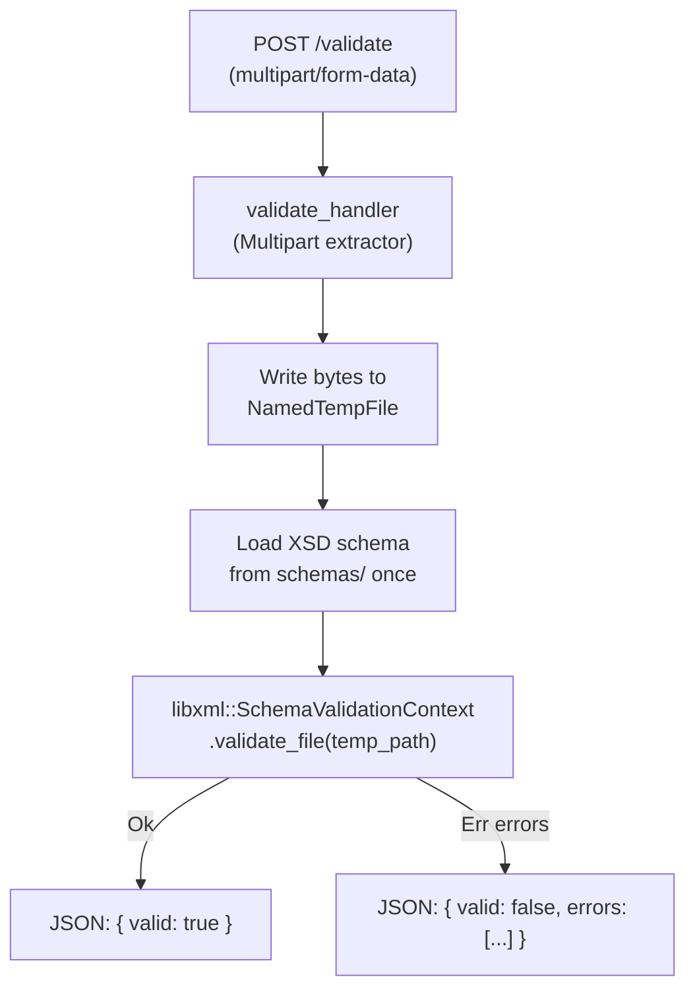

# XSD Validation Handler

## Library Choice: `libxml` (v0.3)

The `libxml` crate wraps libxml2's `xmlschemas` module — the only production-grade XSD validator accessible from Rust. It provides:
- `SchemaParserContext::from_file(path)` — loads the XSD
- `SchemaValidationContext::from_parser(parser)` — builds a validator
- `validate_file(path)` → `Result<(), Vec<StructuredError>>` — validates with full error detail

`StructuredError` contains: `message`, `level`, `filename`, `line`, `col`, `domain`, `code`.

Uppsala and `xmlschema` are newer but their XSD validation APIs are immature and not yet production-safe for complex real-world schemas like this one.

> **System prerequisite:** `libxml2` and its dev headers must be present (`brew install libxml2` on macOS, `apt install libxml2-dev` on Linux).

## Flow



## Files to Change

- **[`Cargo.toml`](Cargo.toml)** — add `axum` `multipart` feature, `libxml`, `tempfile`
- **[`src/handlers/mod.rs`](src/handlers/mod.rs)** — add `validate` handler + request/response types; add schema constant
- **[`src/routes/mod.rs`](src/routes/mod.rs)** — register `POST /validate`
- **[`src/error.rs`](src/error.rs)** — add `AppError::Validation` variant and a catch-all `anyhow`/string variant if needed

## Response Design

```json
{
  "valid": false,
  "errors": [
    {
      "message": "Element '{...}ФайлПакет': No matching global declaration...",
      "level": "Error",
      "line": 3,
      "column": 14,
      "filename": null
    }
  ]
}
```

`ValidationResponse { valid: bool, errors: Vec<ValidationError> }`  
`ValidationError { message: Option<String>, level: String, line: Option<i32>, column: Option<i32>, filename: Option<String> }`

## Key Implementation Details

- The XSD file path is resolved at runtime relative to `CARGO_MANIFEST_DIR` (dev) or `./schemas/` (production) using a constant `DP_PAKET_EIS_01_00` = `"DP_PAKET_EIS_01_00.xsd"`.
- The uploaded file bytes are written to a `NamedTempFile` (via `tempfile` crate) because `validate_file` needs a filesystem path (libxml2 requirement for Windows-1251 encoded XSD references). The temp file is cleaned up automatically on drop.
- Schema loading is **not** cached (libxml `SchemaValidationContext` is not `Send + Sync`), so it is created per-request. This is acceptable given validation complexity dominates schema-parse cost.
- `axum` is updated to enable the `multipart` feature.
- The handler returns `200 OK` in both valid and invalid cases; only internal errors (failed to read field, schema load failure) return 4xx/5xx.

## Unit Tests

The validation logic will be extracted into a pure function `run_validation(xml_path: &str, schema_path: &str) -> ValidationResponse` so it can be tested without spinning up an HTTP server.

Test cases in `src/handlers/validate.rs` (under `#[cfg(test)]`):

- **`test_valid_xml`** — feed a minimal well-formed XML that satisfies the schema; assert `valid: true` and `errors` is empty.
- **`test_invalid_xml_wrong_root`** — feed XML with a wrong root element; assert `valid: false` and at least one error with a non-empty `message`.
- **`test_invalid_xml_missing_required_field`** — feed XML with the correct root but missing a required child element; assert `valid: false`.
- **`test_malformed_xml`** — feed syntactically broken XML (e.g. unclosed tag); assert `valid: false` and errors contain parse-level details.
- **`test_empty_xml`** — feed an empty byte slice written to a temp file; assert `valid: false`.

Tests use `tempfile::NamedTempFile` to write fixture XML bytes to disk and pass the path to `run_validation`. The schema path is resolved via `env!("CARGO_MANIFEST_DIR")` so tests work from any working directory.

## Changes Summary

- `Cargo.toml`: add `libxml = "0.3"`, `tempfile = "3"`, enable `axum` multipart feature
- `src/handlers/mod.rs`: declare `pub mod validate`; re-export `validate_handler`
- `src/handlers/validate.rs`: `validate_handler`, `run_validation`, `ValidationResponse`, `ValidationError`, `DP_PAKET_EIS_01_00` constant, and `#[cfg(test)]` module
- `src/routes/mod.rs`: `POST /validate` → `handlers::validate_handler`
- `src/error.rs`: extend `AppError` with a `SchemaLoad(String)` variant
